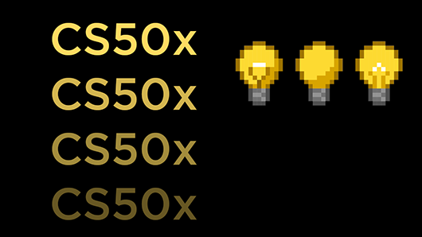

# README

### ⭐️ **Star this repository! It really motivates me to make better explanations and produce more work!!** ⭐️

## Overview

This repository contains two Flask web applications that provide different functionalities and use cases:

1. `finance` - A web application that simulates a stock trading platform.
2. `birthdays` - A web application for managing birthday records.

## Description

### 1. `finance`

#### Purpose

The `finance` program is a Flask web application that simulates a stock trading platform where users can buy and sell stocks, view their portfolio, and check transaction history.

#### How it Works

1. **User Authentication**: Users can register, log in, and manage their account securely.
2. **Portfolio Management**: Users can see their stock holdings, including total net worth.
3. **Buy and Sell Stocks**: Users can search for stocks by symbol, view prices, and execute buy/sell orders.
4. **Transaction History**: Users can review all their past stock transactions, formatted with detailed information.

#### Key Points

- Implements user authentication using hashed passwords.
- Provides buy and sell stock functionalities.
- Integrates a custom helper for currency formatting (`usd`).
- Utilizes an SQLite database for storing user data, transactions, and stock details.

### 2. `birthdays`

#### Purpose

The `birthdays` program is a simple Flask web application that allows users to add and view birthdays.

#### How it Works

1. **Adding Birthdays**: Users can input names, along with the month and day of the birthday.
2. **Displaying Birthdays**: The app displays a list of all recorded birthdays.
3. **Data Persistence**: All data is stored and retrieved from an SQLite database.

#### Key Points

- Handles both GET and POST requests to manage birthday entries.
- Uses SQLite as the database to store and retrieve birthday records.
- Ensures form validation and basic error handling.

## Credits

<table>
  <tr>
    <td></td>
    <td>
      <h3>Credits to CS50x</h3>
      
This project was inspired by and developed as part of the CS50x course offered by Harvard University. CS50x is Harvard University's introduction to the intellectual enterprises of computer science and the art of programming for majors and non-majors alike, with or without prior programming experience.

      <ul>
        <li><strong>Course:</strong> CS50x: Introduction to Computer Science</li>
        <li><strong>Institution:</strong> Harvard University</li>
        <li><strong>Instructor:</strong> David J. Malan</li>
        <li><strong>Website:</strong> [CS50x Official Site](https://cs50.harvard.edu/x/2024/)</li>
      </ul>
      
Thank you to the CS50x team for providing such a comprehensive and engaging introduction to computer science.

    </td>
  </tr>
</table>
